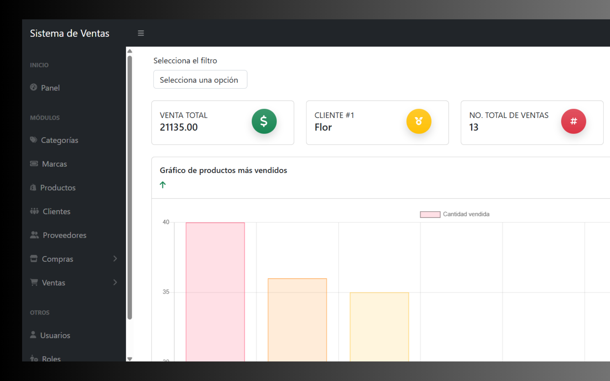

# Sistema Punto de Venta

El Sistema Punto de Venta (POS) es una aplicación web desarrollada con Laravel, enfocada en la gestión eficiente de negocios.

 

## Tecnologías utilizadas

- Laravel
- JavaScript
- MySQL
- Bootstrap
-  HTML5
- Herramientas
    - Spatie
- Plantilla para el administrador
    - SBAdmin
- Librerias:
   - SweetAlert2
   - ChatJS
 
  ##  Funcionalidades principales

-  Panel de administración con control de productos, clientes y ventas, etc.
-  Registro de usuarios con roles específicos
-  Reportes de ventas diarias/semanales/mensuales 

## Visita el sitio 
[Ir al sitio](https://cwalter.silvany.com.mx) 
- usa las siguientes credenciales como usuario invitado:
   - usuario: invitado@gmail.com
   - contraseña: invitado 
